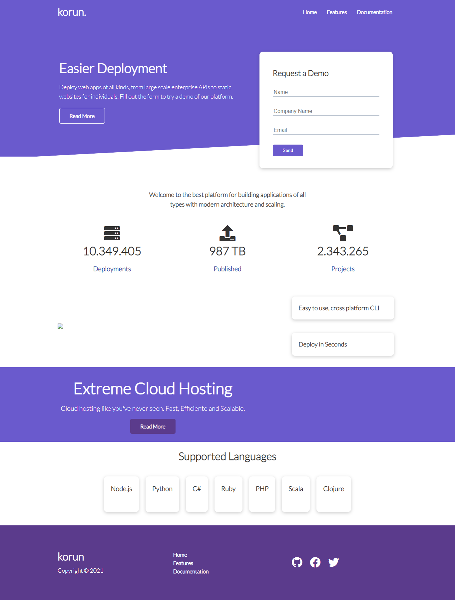

# Fake Cloud Application website

## Table of contents  -   Tabela de conteudos
- [Overview](#overview)   -   Visão Geral
  - [The challenge](#the-challenge)   -   O desafio
  - [Screenshot](#screenshot)   -   Captura de tela
  - [Links](#links)
- [My process](#my-process)   -   [Meu processo]
  - [Built with](#built-with)  -  Feito com
  - [What I learned](#what-i-learned)   -   Oque eu aprendi
  - [Continued development](#continued-development)   -   Desenvolvimento contínuo
  - [Useful resources](#useful-resources)  -   Recursos Úteis
- [Author](#author)

## Overview
Esse foi um site baseado em aplicativos de nuvem, onde temos tanto como a aba principal, como também as outras páginas como a documentação.
A documentação foi a mais interessante de se fazer porque as partes de CSS foram bem interessantes, sofri um bocado para conseguir fazer tudo :D

### The challenge
- Construir o projeto baseado no modelo
- Fazer o CSS da parte da documentação

### Screenshot



### Links
- Live Site URL: (https://julio-henrique.github.io/korun/)

## My process
Eu comecei com facilidade para fazer, mesmo porque todas as páginas conseguiam repetir um pouco do index. 
Depois foi questão de usar bem o Grid e o Flexbox, sabendo alternar entre eles.
Finalizando tudo eu fui para a responsividade.

### Built with
- HTML5 
- CSS
- Grid
- Flexbox


### What I learned
- Uau eu realmente tive um grande desafio no CSS, foi complicado na parte de fazer a página de documentação.

- A parte do formulário também foi um certo desafio, eu tive que fazer ele ficar do lado e bem pequeno, mas eu aprendi muito.
```css
.showcase .grid {
  overflow: visible;
  grid-template-columns: 55% auto;
  gap: 30px;
}
```

- Também a parte de fazer os campos de input para escrever foram muito informativos
```css
.showcase-form input[type='text'],
.showcase-form input[type='email'] {
  border: 0;
  border-bottom: 1px solid #b4becb;
  width: 100%;
  padding: 3px;
  font-size: 16px;
}
```

- As animações deram um destaque incrivel na aplicação
```css
animation: slideInFromRight 1s ease-in;
```

Definitivamente posso dizer que isso foi uma aula de CSS.

### Continued development
Bom vou focar em aproveitar para reler o código, passando o olho e testando tudo, tem muito que eu ainda estou entendendo.
Vou focar o meu aprendizado nessa parte e também nas animações, com uma linha o site já ficou bem mais bonito e vivo, animações são incriveis.

### Useful resources
Tirei a ideia do Traversy Media e fui fazendo, parando quando não sabia e mudando algumas coisas porque pensava que ele fazia um pouco melhor, mas o site no geral foi feito por mim mesmo.

## Author
- Linkedin - [Julio Henrique](https://www.linkedin.com/in/julio-henriqueCS/)
